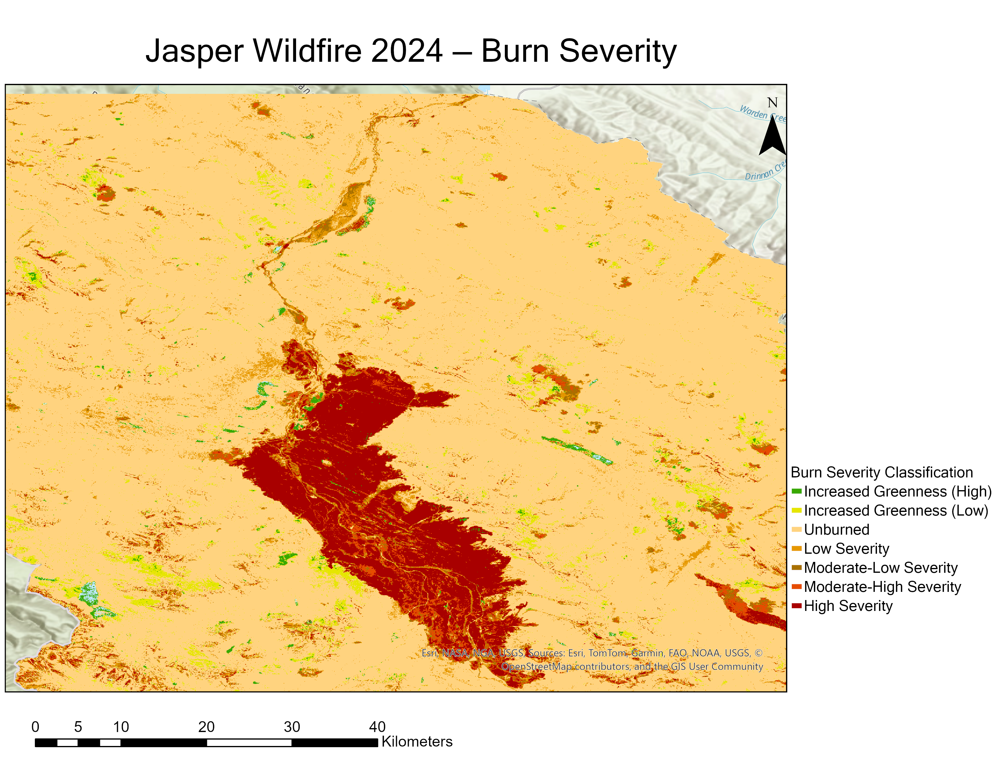

# Jasper Wildfire 2024 — Burn Severity Mapping

Mapped burn severity across Jasper National Park using Sentinel-2 satellite imagery and the dNBR (differenced Normalized Burn Ratio) method.

## Study Area & Context

The 2024 Jasper wildfire (started July 22, 2024) was one of Canada's most destructive urban-interface fires in decades, burning approximately **358 km²** in Jasper National Park and destroying 30–40% of the Jasper townsite.

## Map Output



## Key Results

| Severity Class | Pixel Count | Area (ha) |
|---------------|------------|-----------|
| Increased Greenness High | 17,054 | 2,357 |
| Increased Greenness Low | 100,598 | 13,903 |
| Unburned | 2,605,249 | 360,045 |
| Low Severity | 142,907 | 19,750 |
| Moderate-Low Severity | 58,740 | 8,117 |
| Moderate-High Severity | 63,524 | 8,778 |
| High Severity | 180,475 | 24,939 |

**Moderate-to-high severity total: 41,834 ha — 67.9% of total burned area detected in the imagery**

> Area calculated from pixel counts × pixel size (~1,382 m²/pixel at ~53°N in geographic coordinates).

## Method

| Step | Tool | Description |
|------|------|-------------|
| Satellite imagery | Copernicus Browser | Sentinel-2 L2A, pre-fire (Jul 20) and post-fire (Aug 19) |
| NBR calculation | ArcGIS Pro (Raster Calculator) | NBR = (B8A − B12) / (B8A + B12) |
| dNBR calculation | ArcGIS Pro (Raster Calculator) | dNBR = Pre-fire NBR − Post-fire NBR |
| Study area | Copernicus Browser | Imagery downloaded to cover the Jasper fire area (rectangular footprint within the park boundary) |
| Classification | ArcGIS Pro (Reclassify) | USGS 7-class burn severity scheme |
| Cartography | ArcGIS Pro (Layout) | Final map composition and export |

**Key formula:**
```
NBR  = (Band 8A − Band 12) / (Band 8A + Band 12)
dNBR = Pre-fire NBR − Post-fire NBR
```

## Burn Severity Classes (USGS Standard)

| dNBR Range | Class |
|------------|-------|
| < −0.500 | Increased Greenness High |
| −0.500 to −0.251 | Increased Greenness Low |
| −0.250 to −0.101 | Unburned |
| −0.100 to 0.099 | Low Severity |
| 0.100 to 0.269 | Moderate-Low Severity |
| 0.270 to 0.439 | Moderate-High Severity |
| > 0.440 | High Severity |

## Data Sources

| Data | Source |
|------|--------|
| Sentinel-2 L2A imagery | [Copernicus Data Space](https://dataspace.copernicus.eu) |
| Jasper NP boundary | [Parks Canada Open Data](https://open.canada.ca) |
| Classification scheme | Key & Benson (2006), USGS |
| Method reference | [UN-SPIDER Recommended Practice](https://un-spider.org) |

## Tools Used

- **ArcGIS Pro** — raster processing, classification, cartography
- **Copernicus Browser** — satellite image download and selection
